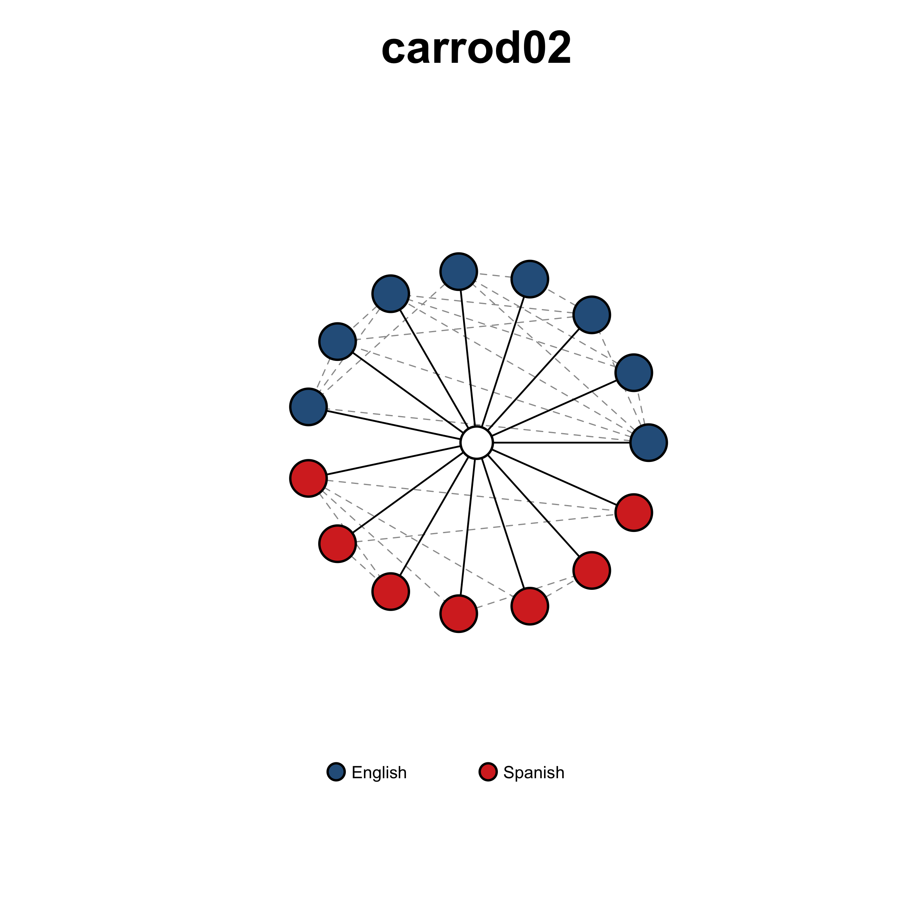
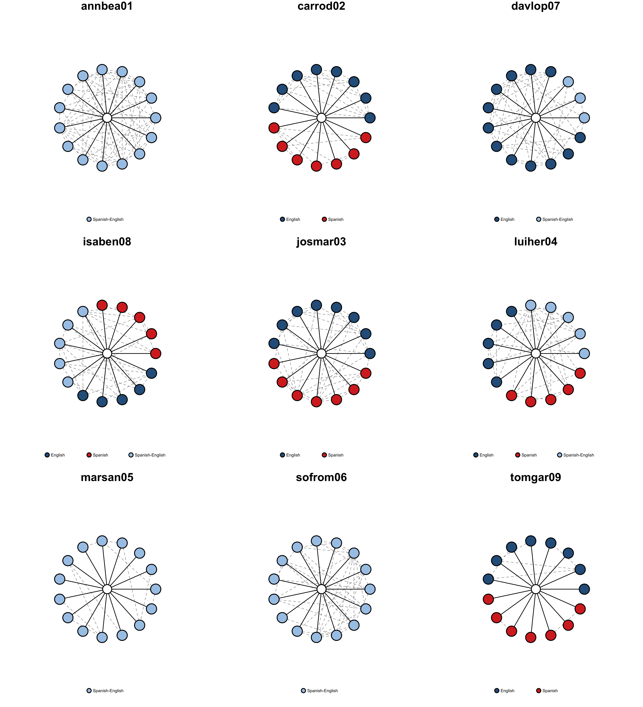
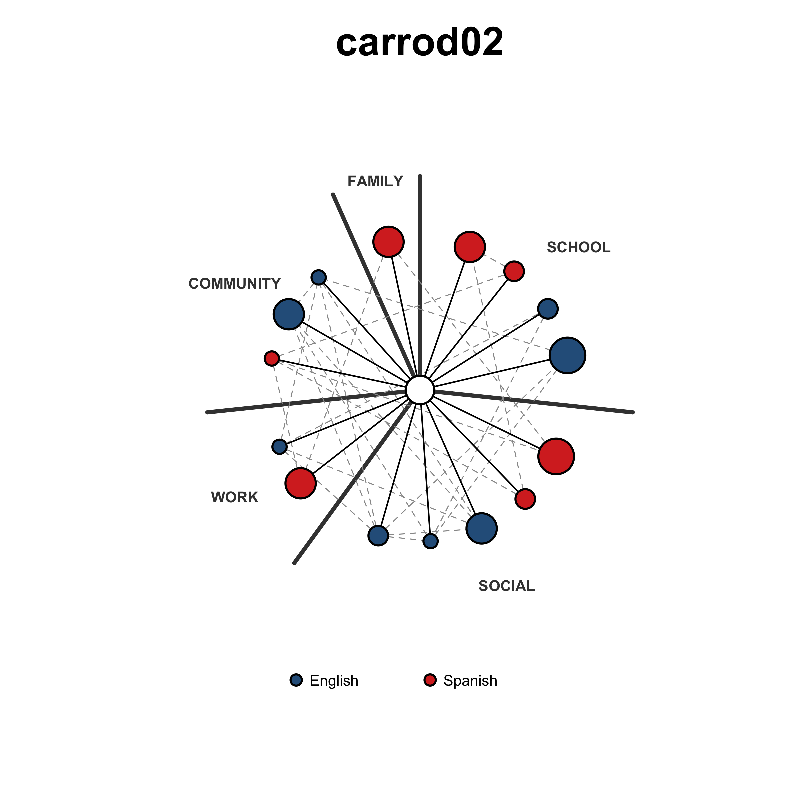
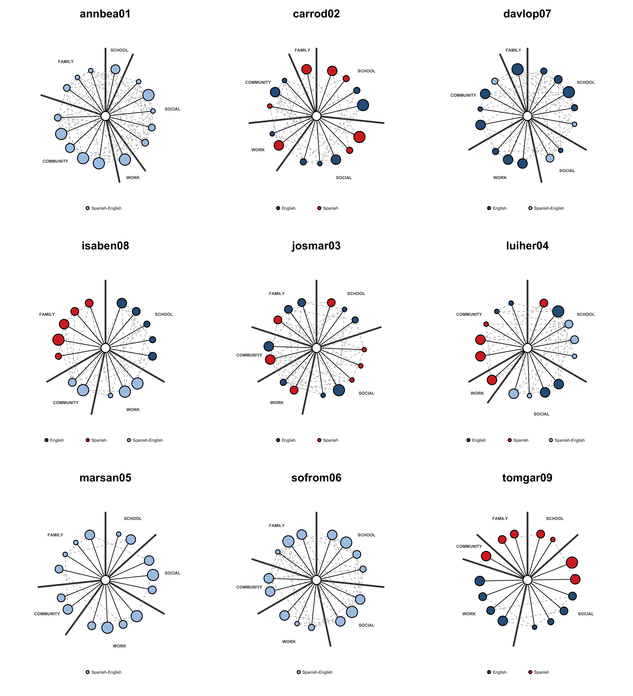

# BiNet Network Visualization
Monica Shen
2026-05-05

-   [Overview](#overview)
-   [0. Setup](#setup)
    -   [0.1 Load Packages](#load-packages)
    -   [0.2 Load Preprocessed Data](#load-preprocessed-data)
    -   [0.3 Color Palette](#color-palette)
-   [1. Graph Construction and Visual Encoding
    Helpers](#graph-construction-and-visual-encoding-helpers)
    -   [1.1 Build igraph Object](#build-igraph-object)
    -   [1.2 Visual Encoding Helpers](#visual-encoding-helpers)
-   [2. Basic Network Plot](#basic-network-plot)
    -   [2.1 Functions](#functions)
    -   [2.2 Single-Ego Example](#single-ego-example)
    -   [2.3 Full-Ego Panel](#full-ego-panel)
-   [3. Contextualized Network Plot](#contextualized-network-plot)
    -   [3.1 Functions](#functions-1)
    -   [3.2 Single-Ego Example](#single-ego-example-1)
    -   [3.3 Multi-Ego Panel](#multi-ego-panel)
-   [4. Customizing Visual Encodings](#customizing-visual-encodings)
    -   [4.1 Node Color: `languageUsedCategory`
        vs. `languageKnownCategory`](#node-color-languageusedcategory-vs.-languageknowncategory)
    -   [4.2 Node Size: Emotional Closeness, Interaction Frequency, or
        CS
        Frequency](#node-size-emotional-closeness-interaction-frequency-or-cs-frequency)
-   [5. Export Network Plots](#export-network-plots)
    -   [5.1 Basic Network Plots](#basic-network-plots)
    -   [5.2 Contextualized Network
        Plots](#contextualized-network-plots)

## Overview

This script provides a step-by-step guide to visualizing BiNet personal
networks using R. It is a companion to the BiNet preprocessing tutorial
(`BiNet_preprocessing_tutorial.qmd`) and assumes that the preprocessing
pipeline has been run and that the output files are present in
`./preprocessed_data/`. See the preprocessing tutorial for details on
how these files are generated.

Two visualization approaches are provided:

1.  **Basic Network Plot (§2):** Alters arranged on a uniform circle
    with no interaction context grouping. Node size is uniform; color
    encodes `languageUsedCategory`. Useful for a quick check of language
    distribution and tie density.

2.  **Contextualized Network Plot (§3):** Alters grouped within labeled
    arcs, one per occupied interaction context. Arc widths are
    proportional to alter counts. Node size encodes
    `ego_alter_emotional_closeness` by default and can be remapped to
    interaction frequency or codeswitching frequency. Color can encode
    either `languageUsedCategory` or `languageKnownCategory`.

**References**

-   igraph package: <https://igraph.org/r/>
-   R Graph Gallery (igraph):
    <https://r-graph-gallery.com/package/igraph.html>

------------------------------------------------------------------------

## 0. Setup

### 0.1 Load Packages

``` r
packages <- c("dplyr", "tidyr", "stringr", "readr",
              "igraph", "scales", "purrr")

installed_packages <- packages %in% rownames(installed.packages())
if (any(!installed_packages)) {
  install.packages(packages[!installed_packages])
}

invisible(lapply(packages, library, character.only = TRUE))
```

### 0.2 Load Preprocessed Data

The three files below are produced by the
`BiNet_preprocessing_tutorial.qmd`. `tidy_alter` contains one row per
ego–alter dyad with all alter attributes needed for visualization.
`edgelist_linked` contains one row per alter–alter tie. `egoData_linked`
contains one row per ego with ego IDs used as plot titles.

tidy_alter \<- readr::read_csv(“./Compositional
measures/binet_tidy_alter.csv”,

show_col_types = FALSE)

edgelist_linked \<-
readr::read_csv(“./preprocessed_data/edgelist_linked.csv”,

show_col_types = FALSE)

egoData_linked \<- readr::read_csv(“./Compositional
measures/binet_egoData_linked.csv”,

show_col_types = FALSE)

cat(“Loaded:\n”)

cat(” tidy_alter: “, nrow(tidy_alter),”rows\n”)

cat(” edgelist_linked: “, nrow(edgelist_linked),”rows\n”)

cat(” egoData_linked: “, nrow(egoData_linked),”rows\n”)

``` r
tidy_alter      <- readr::read_csv(
  "../BiNet_preprocessing_compositional_Measures/Compositional measures/binet_tidy_alter.csv",
  show_col_types = FALSE)

edgelist_linked <- readr::read_csv(
  "../BiNet_preprocessing_compositional_Measures/preprocessed_data/edgelist_linked.csv",
  show_col_types = FALSE)

egoData_linked  <- readr::read_csv(
  "../BiNet_preprocessing_compositional_Measures/Compositional measures/binet_egoData_linked.csv",
  show_col_types = FALSE)

cat("Loaded:\n")
cat(" tidy_alter:      ", nrow(tidy_alter),      "rows\n")
cat(" edgelist_linked: ", nrow(edgelist_linked),  "rows\n")
cat(" egoData_linked:  ", nrow(egoData_linked),   "rows\n")
```

### 0.3 Color Palette

`lang_colors` maps each `languageUsedCategory` and
`languageKnownCategory` level to a display color. Update the labels and
hex codes to match the focal languages in your study.

``` r
lang_colors <- c(
  "Spanish"         = "#D73027",
  "English"         = "#2C5F8A",
  "Spanish-English" = "#A8C8E8",
  "Other"           = "gray"
)
```

------------------------------------------------------------------------

## 1. Graph Construction and Visual Encoding Helpers

### 1.1 Build igraph Object

`build_ego_igraph()` constructs an undirected `igraph` object for one
ego from `tidy_alter` and `edgelist_linked`. All alter attributes are
attached as vertex attributes so they are accessible inside the plot
functions. Edges are tagged as `"ego_edge"` (ego → alter) or
`"alter_edge"` (alter ↔ alter).

``` r
build_ego_igraph <- function(ego_uuid, alter_df, edge_df) {

  alters <- alter_df |>
    dplyr::filter(networkCanvasEgoUUID == ego_uuid) |>
    dplyr::mutate(name = as.character(nodeID)) |>
    dplyr::select(name, dplyr::everything())

  # Ego vertex: copy column structure, blank all values
  ego_row <- alters[1L, ]
  ego_row[seq_along(ego_row)] <- NA
  ego_row$name <- "ego"
  vertices <- dplyr::bind_rows(alters, ego_row)

  # UUID → nodeID lookup (resolves edgelist source/target)
  uuid_map <- alter_df |>
    dplyr::filter(networkCanvasEgoUUID == ego_uuid) |>
    dplyr::select(networkCanvasUUID, nodeID)

  alter_edges <- edge_df |>
    dplyr::filter(networkCanvasEgoUUID == ego_uuid) |>
    dplyr::left_join(
      uuid_map |> dplyr::rename(networkCanvasSourceUUID = networkCanvasUUID,
                                from_nodeID             = nodeID),
      by = "networkCanvasSourceUUID"
    ) |>
    dplyr::left_join(
      uuid_map |> dplyr::rename(networkCanvasTargetUUID = networkCanvasUUID,
                                to_nodeID               = nodeID),
      by = "networkCanvasTargetUUID"
    ) |>
    dplyr::transmute(
      from      = as.character(from_nodeID),
      to        = as.character(to_nodeID),
      edge_type = "alter_edge"
    ) |>
    dplyr::filter(!is.na(from), !is.na(to))

  ego_edges <- alters |>
    dplyr::filter(name != "ego") |>
    dplyr::transmute(from = "ego", to = name, edge_type = "ego_edge")

  igraph::graph_from_data_frame(
    d        = dplyr::bind_rows(alter_edges, ego_edges),
    directed = FALSE,
    vertices = vertices
  )
}
```

### 1.2 Visual Encoding Helpers

Three helpers handle the visual encoding shared across both plot styles.
Each accepts an argument that lets you remap the encoding to a different
variable — see §4 for a full customization guide.

``` r
# Node colors
# Default: languageUsedCategory (language ego uses with the alter)
# Alternative: color_var = "languageKnownCategory" (language(s) alter knows)
get_node_colors <- function(g,
                            lang_colors,
                            color_var = "languageUsedCategory",
                            ego_name  = "ego") {
  vnames <- igraph::V(g)$name
  is_ego <- vnames == ego_name
  attr   <- igraph::vertex_attr(g, color_var)
  vcol   <- rep("gray80", igraph::vcount(g))
  vcol[!is_ego] <- unname(lang_colors[as.character(attr[!is_ego])])
  vcol[is.na(vcol)] <- "gray80"
  vcol[is_ego] <- "white"
  vcol
}

# Node sizes
# Default: ego_alter_emotional_closeness (1–5 → rescaled to size_range)
# Alternatives:
#   size_var = "ego_alter_interaction_frequency"  (1–5)
#   size_var = "ego_alter_cs_frequency"           (1–4; NA = monolingual dyad)
#   size_var = NULL                               → uniform size for all alters
get_node_sizes <- function(g,
                           size_var   = "ego_alter_emotional_closeness",
                           ego_name   = "ego",
                           ego_size   = 16,
                           size_range = c(8, 20)) {
  vnames <- igraph::V(g)$name
  is_ego <- vnames == ego_name

  if (is.null(size_var)) {
    return(ifelse(is_ego, ego_size, mean(size_range)))
  }

  vals        <- suppressWarnings(as.numeric(igraph::vertex_attr(g, size_var)))
  finite_vals <- vals[is.finite(vals)]
  val_range   <- if (length(finite_vals) >= 2L) range(finite_vals) else c(1, 5)
  vals_filled <- dplyr::coalesce(vals, mean(val_range))

  ifelse(
    is_ego, ego_size,
    scales::rescale(vals_filled, to = size_range, from = val_range)
  )
}

# Edge widths
# Default: uniform (ego_edge = 1.5, alter_edge = 1.0).
# Pass edge_weight_var to scale alter–alter edge width by a tie-level attribute.
# BiNet alter–alter ties are currently unweighted; this argument is provided
# for extensibility with weighted protocols.
get_edge_widths <- function(g, edge_weight_var = NULL) {
  edge_type <- igraph::E(g)$edge_type
  if (is.null(edge_weight_var)) {
    return(ifelse(edge_type == "ego_edge", 1.5, 1.0))
  }
  raw     <- suppressWarnings(as.numeric(igraph::edge_attr(g, edge_weight_var)))
  base    <- ifelse(edge_type == "ego_edge", 1.5, 1.0)
  alter_w <- scales::rescale(
    dplyr::coalesce(raw, 1),
    to = c(0.5, 3), from = range(raw, na.rm = TRUE)
  )
  ifelse(edge_type == "ego_edge", base, alter_w)
}

# Language legend
# Draws a horizontal legend showing only the language categories present
# in the plotted ego's network. Legend symbols use pch = 21 (filled circle
# with black border) to match the vertex style used in the plots.
draw_lang_legend <- function(g,
                             lang_colors,
                             color_var = "languageUsedCategory",
                             ego_name  = "ego",
                             x         = "bottom",
                             cex       = 0.9,
                             pt.cex    = 2) {
  is_ego       <- igraph::V(g)$name == ego_name
  attr         <- igraph::vertex_attr(g, color_var)
  present_cats <- sort(unique(stats::na.omit(as.character(attr[!is_ego]))))
  present_cats <- present_cats[present_cats %in% names(lang_colors)]
  if (length(present_cats) > 0L) {
    legend(x          = x,
           legend     = present_cats,
           col        = "black",
           pt.bg      = unname(lang_colors[present_cats]),
           pch        = 21,
           pt.lwd     = 2,
           horiz      = TRUE,
           bty        = "n",
           cex        = cex,
           pt.cex     = pt.cex,
           x.intersp  = 1,
           text.width = 0.6)
  }
}
```

------------------------------------------------------------------------

## 2. Basic Network Plot

The basic network plot places alters at equal angular spacing around a
circle with the ego at the center. Node size is **uniform** for all
alters; color encodes `languageUsedCategory`. No context information
determines position. This layout is useful for:

-   verifying graph construction (all 15 alters present, edges resolved)
-   inspecting overall language distribution and tie density in a clean,
    uncluttered layout
-   cases where interaction context is missing for some alters

Two functions work together: `layout_circle()` computes node positions
(ego at origin, alters on a uniform ring), and `plot_ego_basic()` calls
the above and renders the plot.

### 2.1 Functions

``` r
# Uniform circle layout
layout_circle <- function(g, ego_name = "ego", r = 0.85) {
  vnames    <- igraph::V(g)$name
  ego_idx   <- which(vnames == ego_name)
  alter_idx <- setdiff(seq_len(igraph::vcount(g)), ego_idx)
  m         <- length(alter_idx)
  ang       <- seq(0, 2 * pi, length.out = m + 1L)[seq_len(m)]

  xy                <- matrix(NA_real_, nrow = igraph::vcount(g), ncol = 2)
  xy[ego_idx,    ]  <- c(0, 0)
  xy[alter_idx, 1]  <- r * cos(ang)
  xy[alter_idx, 2]  <- r * sin(ang)
  xy
}

# Basic network plot
#
# Arguments:
#   ego_uuid        — networkCanvasEgoUUID for the ego to plot
#   alter_df        — tidy_alter
#   edge_df         — edgelist_linked
#   lang_colors     — named color vector for languageUsedCategory levels
#   title           — plot title (defaults to ego_uuid if NULL)
#   show_labels     — if TRUE, print nodeID beside each alter node
#   color_var       — vertex attribute mapped to node color:
#                     "languageUsedCategory" (default) or "languageKnownCategory"
#   edge_weight_var — edge attribute mapped to alter–alter edge width; NULL = uniform
plot_ego_basic <- function(ego_uuid,
                           alter_df,
                           edge_df,
                           lang_colors,
                           title           = NULL,
                           show_labels     = FALSE,
                           color_var       = "languageUsedCategory",
                           edge_weight_var = NULL) {

  g         <- build_ego_igraph(ego_uuid, alter_df, edge_df)
  vnames    <- igraph::V(g)$name
  is_ego    <- vnames == "ego"
  vcol      <- get_node_colors(g, lang_colors, color_var = color_var)
  vsize     <- ifelse(is_ego, 16, 18)   # uniform alter size
  ewidth    <- get_edge_widths(g, edge_weight_var = edge_weight_var)
  edge_type <- igraph::E(g)$edge_type
  lay       <- layout_circle(g, r = 0.85)

  plot(0, 0, type = "n",
       xlim = c(-1.6, 1.6), ylim = c(-1.6, 1.6),
       xlab = "", ylab = "", axes = FALSE, asp = 1,
       main     = if (!is.null(title)) title else ego_uuid,
       cex.main = 2.4)

  plot(g,
       layout             = lay,
       add                = TRUE,
       rescale            = FALSE,
       xlim               = c(-1.6, 1.6),
       ylim               = c(-1.6, 1.6),
       vertex.color       = vcol,
       vertex.size        = vsize,
       vertex.frame.color = "black",
       vertex.frame.width = 2,
       vertex.label       = if (show_labels) vnames else NA,
       vertex.label.cex   = 0.65,
       edge.color         = ifelse(edge_type == "ego_edge", "black", "gray60"),
       edge.width         = ewidth,
       edge.lty           = ifelse(edge_type == "ego_edge", 1, 2))

  draw_lang_legend(g, lang_colors, color_var = color_var)
  invisible(g)
}
```

### 2.2 Single-Ego Example

**Basic network plot for one ego example.** Alters are arranged on a
uniform circle; all alter nodes are the same size. Node color = language
used with alter. Solid lines = ego–alter ties; dashed lines =
alter–alter ties.

``` r
plot_ego_basic(
  ego_uuid    = egoData_linked$networkCanvasEgoUUID[2],
  alter_df    = tidy_alter,
  edge_df     = edgelist_linked,
  lang_colors = lang_colors,
  title       = egoData_linked$ego_id[2]
)
```



### 2.3 Full-Ego Panel

Basic network plots for all egos. Each panel represents one participant
(ego; white central node) and their 15 nominated interaction partners
(alters; outer nodes). Solid black lines = ego–alter ties; dashed gray
lines = alter–alter ties. Node color = language used with alter.

``` r
n_ego  <- nrow(egoData_linked)
n_cols <- min(3L, n_ego)
n_rows <- ceiling(n_ego / n_cols)
par(mfrow = c(n_rows, n_cols), mar = c(2, 1.5, 2, 1.5))

purrr::walk2(
  egoData_linked$networkCanvasEgoUUID,
  egoData_linked$ego_id,
  ~ plot_ego_basic(
      ego_uuid    = .x,
      alter_df    = tidy_alter,
      edge_df     = edgelist_linked,
      lang_colors = lang_colors,
      title       = .y
    )
)
```



``` r
par(mfrow = c(1, 1))
```

------------------------------------------------------------------------

## 3. Contextualized Network Plot

The contextualized network plot extends the basic plot by grouping
alters within labeled arcs, one per occupied interaction context.
Spatial position now carries meaning: alters in the same arc share an
interaction context.

Egos vary in how many of the five BiNet interaction contexts (family,
community, school, work, social) are represented in their networks.
Fixing five sectors regardless of the data would produce empty arcs with
labels pointing at blank space. We therefore adopt a dynamic approach
that includes only contexts with at least one alter, so the ring always
uses exactly the sectors present in each ego’s data:

<table>
<thead>
<tr>
<th style="text-align: center;">Occupied Contexts</th>
<th>Layout Produced</th>
</tr>
</thead>
<tbody>
<tr>
<td style="text-align: center;">5</td>
<td>Five sectors (72° each)</td>
</tr>
<tr>
<td style="text-align: center;">4</td>
<td>Four sectors (90° each)</td>
</tr>
<tr>
<td style="text-align: center;">3</td>
<td>Three sectors (120° each)</td>
</tr>
<tr>
<td style="text-align: center;">2</td>
<td>Two half-rings (180° each)</td>
</tr>
<tr>
<td style="text-align: center;">1</td>
<td>Single labeled arc</td>
</tr>
</tbody>
</table>

Arc widths are proportional to alter counts by default
(`proportional = TRUE`), so a context with 8 alters receives more
angular space than one with 2, reducing node crowding within dense
sectors. Pass `proportional = FALSE` for equal arc widths regardless of
alter counts.

### 3.1 Functions

``` r
# Canonical sector order: arranged by social distance from the ego's
# home environment, clockwise from the top.
SECTOR_ORDER  <- c("family", "community", "work", "social", "school")
SECTOR_LABELS <- c(
  family    = "FAMILY",
  community = "COMMUNITY",
  work      = "WORK",
  social    = "SOCIAL",
  school    = "SCHOOL"
)
```

``` r
# Compute dynamic sector arcs
# Given a named integer vector of alter counts per context, returns a named
# list of c(start_angle, end_angle) in radians for each occupied context.
# The ring starts at pi/2 (12 o'clock) and sweeps counter-clockwise.
compute_sector_arcs <- function(ctx_counts, proportional = TRUE) {
  occupied <- SECTOR_ORDER[SECTOR_ORDER %in% names(ctx_counts) &
                             ctx_counts[SECTOR_ORDER] > 0L]
  if (length(occupied) == 0L) return(list())

  weights    <- if (proportional) ctx_counts[occupied] else rep(1L, length(occupied))
  weights    <- weights / sum(weights)
  arc_widths <- weights * 2 * pi

  start_ang   <- pi / 2
  arcs        <- vector("list", length(occupied))
  names(arcs) <- occupied

  for (i in seq_along(occupied)) {
    end_ang             <- start_ang + arc_widths[i]
    arcs[[occupied[i]]] <- c(start_ang, end_ang)
    start_ang           <- end_ang
  }
  arcs
}

# Dynamic-sector ring layout
# Places the ego at the origin. Each alter is positioned within the arc
# for its ego_alter_interaction_context, evenly spaced within the arc
# (boundary angles excluded to avoid node overlap at sector edges).
# Alters with missing or unrecognised context are placed on a fallback
# uniform ring and trigger a warning.
layout_sector_ring <- function(g,
                               ego_name     = "ego",
                               r            = 0.85,
                               proportional = TRUE) {

  vnames    <- igraph::V(g)$name
  n_nodes   <- igraph::vcount(g)
  ego_idx   <- which(vnames == ego_name)
  alter_idx <- setdiff(seq_len(n_nodes), ego_idx)
  ctx_attr  <- igraph::V(g)$ego_alter_interaction_context

  ctx_counts <- vapply(SECTOR_ORDER, function(ctx) {
    sum(!is.na(ctx_attr[alter_idx]) & ctx_attr[alter_idx] == ctx)
  }, integer(1L))

  arcs          <- compute_sector_arcs(ctx_counts, proportional = proportional)
  xy            <- matrix(NA_real_, nrow = n_nodes, ncol = 2)
  xy[ego_idx, ] <- c(0, 0)

  for (ctx in names(arcs)) {
    in_ctx <- alter_idx[!is.na(ctx_attr[alter_idx]) & ctx_attr[alter_idx] == ctx]
    if (length(in_ctx) == 0L) next
    arc    <- arcs[[ctx]]
    thetas <- seq(arc[1], arc[2],
                  length.out = length(in_ctx) + 2L)[seq(2L, length(in_ctx) + 1L)]
    xy[in_ctx, 1] <- r * cos(thetas)
    xy[in_ctx, 2] <- r * sin(thetas)
  }

  # Fallback for missing / unrecognised context
  unplaced <- alter_idx[is.na(xy[alter_idx, 1])]
  if (length(unplaced) > 0L) {
    fb_ang <- seq(0, 2 * pi,
                  length.out = length(unplaced) + 1L)[seq_len(length(unplaced))]
    xy[unplaced, 1] <- r * cos(fb_ang)
    xy[unplaced, 2] <- r * sin(fb_ang)
    warning(length(unplaced),
            " alter(s) had missing/unrecognised context and were placed ",
            "using the fallback layout.")
  }
  xy
}

# Sector boundary lines and labels
# Draws a radial line at each arc boundary, starting at the ego node edge
# (r_inner) and ending at the alter ring (r_outer). Places a bold label
# at each arc midpoint just outside the ring (label_r = r_canvas * 0.8).
# No boundary lines are drawn when only one sector is present.
draw_sector_guides <- function(arcs,
                               r_inner   = 0.04,
                               r_outer   = 1.2,
                               r_canvas  = 1.5,
                               cex_label = 0.9,
                               lwd       = 4,
                               guide_col = "gray25") {

  n_sectors <- length(arcs)
  if (n_sectors == 0L) return(invisible(NULL))

  if (n_sectors > 1L) {
    boundary_angs <- unique(unlist(arcs))
    for (ang in boundary_angs) {
      segments(r_inner * cos(ang), r_inner * sin(ang),
               r_outer * cos(ang), r_outer * sin(ang),
               col = guide_col, lty = 1, lwd = lwd)
    }
  }

  label_r <- r_canvas * 0.8
  for (ctx in names(arcs)) {
    mid_ang <- mean(arcs[[ctx]])
    text(label_r * cos(mid_ang),
         label_r * sin(mid_ang),
         SECTOR_LABELS[ctx],
         font = 2, cex = cex_label, col = guide_col)
  }
}

# Contextualized network plot
# Arguments:
#   ego_uuid        — networkCanvasEgoUUID for the ego to plot
#   alter_df        — tidy_alter
#   edge_df         — edgelist_linked
#   lang_colors     — named color vector for the chosen color_var levels
#   title           — plot title (defaults to ego_uuid if NULL)
#   show_labels     — if TRUE, print nodeID beside each alter node
#   proportional    — if TRUE, arc widths ∝ alter counts per context
#   color_var       — vertex attribute mapped to node color:
#                     "languageUsedCategory" (default) or "languageKnownCategory"
#   size_var        — vertex attribute mapped to node size:
#                     "ego_alter_emotional_closeness" (default),
#                     "ego_alter_interaction_frequency",
#                     "ego_alter_cs_frequency", or NULL (uniform)
#   edge_weight_var — edge attribute mapped to alter–alter edge width; NULL = uniform
plot_ego_sector <- function(ego_uuid,
                            alter_df,
                            edge_df,
                            lang_colors,
                            title           = NULL,
                            show_labels     = FALSE,
                            proportional    = TRUE,
                            color_var       = "languageUsedCategory",
                            size_var        = "ego_alter_emotional_closeness",
                            edge_weight_var = NULL) {

  g         <- build_ego_igraph(ego_uuid, alter_df, edge_df)
  vnames    <- igraph::V(g)$name
  vcol      <- get_node_colors(g, lang_colors, color_var = color_var)
  vsize     <- get_node_sizes(g, size_var = size_var)
  ewidth    <- get_edge_widths(g, edge_weight_var = edge_weight_var)
  edge_type <- igraph::E(g)$edge_type

  # Compute arcs for both layout and guide drawing
  alter_idx  <- which(vnames != "ego")
  ctx_attr   <- igraph::V(g)$ego_alter_interaction_context
  ctx_counts <- vapply(SECTOR_ORDER, function(ctx) {
    sum(!is.na(ctx_attr[alter_idx]) & ctx_attr[alter_idx] == ctx)
  }, integer(1L))
  arcs <- compute_sector_arcs(ctx_counts, proportional = proportional)
  lay  <- layout_sector_ring(g, r = 0.85, proportional = proportional)

  plot(0, 0, type = "n",
       xlim = c(-1.6, 1.6), ylim = c(-1.6, 1.6),
       xlab = "", ylab = "", axes = FALSE, asp = 1,
       main     = if (!is.null(title)) title else ego_uuid,
       cex.main = 2.4)

  # Sector guides drawn before nodes so lines sit behind the network
  draw_sector_guides(arcs, r_inner = 0.04, r_outer = 1.2,
                     r_canvas = 1.5, cex_label = 0.9, lwd = 4)

  plot(g,
       layout             = lay,
       add                = TRUE,
       rescale            = FALSE,
       xlim               = c(-1.6, 1.6),
       ylim               = c(-1.6, 1.6),
       vertex.color       = vcol,
       vertex.size        = vsize,
       vertex.frame.color = "black",
       vertex.frame.width = 2,
       vertex.label       = if (show_labels) vnames else NA,
       vertex.label.cex   = 0.65,
       edge.color         = ifelse(edge_type == "ego_edge", "black", "gray60"),
       edge.width         = ewidth,
       edge.lty           = ifelse(edge_type == "ego_edge", 1, 2))

  draw_lang_legend(g, lang_colors, color_var = color_var,
                   x = "bottom", cex = 0.9, pt.cex = 1.5)
  invisible(g)
}
```

### 3.2 Single-Ego Example

Contextualized network plot for one ego example. Alters are grouped into
arcs by interaction context; arc width is proportional to alter counts.
Node color = language used with alter; node size = emotional closeness
(larger = closer). Solid lines = ego–alter ties; dashed lines =
alter–alter ties. Sector boundaries are drawn as solid gray radial
lines.

``` r
plot_ego_sector(
  ego_uuid    = egoData_linked$networkCanvasEgoUUID[2],
  alter_df    = tidy_alter,
  edge_df     = edgelist_linked,
  lang_colors = lang_colors,
  title       = egoData_linked$ego_id[2]
)
```



### 3.3 Multi-Ego Panel

Contextualized network plots for all egos. Each panel uses only the
sectors occupied in that ego’s data; arc widths are proportional to
alter counts per context.

``` r
n_ego  <- nrow(egoData_linked)
n_cols <- min(3L, n_ego)
n_rows <- ceiling(n_ego / n_cols)
par(mfrow = c(n_rows, n_cols), mar = c(2, 1.5, 2, 1.5), pty = "s")

purrr::walk2(
  egoData_linked$networkCanvasEgoUUID,
  egoData_linked$ego_id,
  ~ plot_ego_sector(
      ego_uuid    = .x,
      alter_df    = tidy_alter,
      edge_df     = edgelist_linked,
      lang_colors = lang_colors,
      title       = .y
    )
)
```



``` r
par(mfrow = c(1, 1))
```

------------------------------------------------------------------------

## 4. Customizing Visual Encodings

Both `plot_ego_basic()` and `plot_ego_sector()` accept arguments that
remap visual channels to different variables without modifying the
functions. The table below summarizes the available encodings.

<table>
<colgroup>
<col style="width: 25%" />
<col style="width: 25%" />
<col style="width: 25%" />
<col style="width: 25%" />
</colgroup>
<thead>
<tr>
<th>Visual Channel</th>
<th>Argument</th>
<th>Default</th>
<th>Alternatives</th>
</tr>
</thead>
<tbody>
<tr>
<td>Node color</td>
<td><code>color_var</code></td>
<td><code>"languageUsedCategory"</code></td>
<td><code>"languageKnownCategory"</code></td>
</tr>
<tr>
<td>Node size <em>(sector only)</em></td>
<td><code>size_var</code></td>
<td><code>"ego_alter_emotional_closeness"</code></td>
<td><code>"ego_alter_interaction_frequency"</code>,
<code>"ego_alter_cs_frequency"</code>, <code>NULL</code> (uniform)</td>
</tr>
<tr>
<td>Alter–alter edge width</td>
<td><code>edge_weight_var</code></td>
<td><code>NULL</code> (uniform)</td>
<td>Any numeric edge attribute</td>
</tr>
<tr>
<td>Sector arc width</td>
<td><code>proportional</code></td>
<td><code>TRUE</code> (∝ alter count)</td>
<td><code>FALSE</code> (equal arcs)</td>
</tr>
</tbody>
</table>

### 4.1 Node Color: `languageUsedCategory` vs. `languageKnownCategory`

**`languageUsedCategory`** (default) reflects the language(s) the ego
uses with each alter in communication. This is the primary encoding for
visualizing the ego’s active language behavior across the network.

**`languageKnownCategory`** reflects the language(s) the alter knows
overall, regardless of which language the ego chooses to use with them.
This encoding is useful for visualizing the linguistic composition of
the ego’s social environment — for example, identifying whether the ego
is surrounded primarily by Spanish-dominant, English-dominant, or
bilingual alters. This variable is also used in the structural measures
(E-I index, betweenness centrality) in the BiNet structural analysis
script.

### 4.2 Node Size: Emotional Closeness, Interaction Frequency, or CS Frequency

Node size in `plot_ego_sector()` can encode any ordinal alter-level
attribute via the `size_var` argument. The three meaningful options in
BiNet are:

-   **`"ego_alter_emotional_closeness"`** (default, 1–5): Larger nodes
    are alters the ego feels closer to. Useful for identifying whether
    intimate relationships cluster in particular contexts or language
    groups.
-   **`"ego_alter_interaction_frequency"`** (1–5): Larger nodes are
    alters the ego interacts with more often. Useful for identifying the
    most active communicative relationships.
-   **`"ego_alter_cs_frequency"`** (1–4, `NA` for monolingual dyads):
    Larger nodes are alters with whom the ego codeswitches more.
    Monolingual dyads (`NA`) receive the midpoint size. Useful for
    identifying whether codeswitching is concentrated in specific
    contexts or with specific types of alters.
-   **`NULL`**: All alter nodes are drawn at the same size (18 pt).

------------------------------------------------------------------------

## 5. Export Network Plots

Individual network plots can be saved as high-resolution PNG files for
use in manuscripts or presentations. The chunks below save one file per
ego to a local folder. Both chunks are set to `eval=FALSE` so they do
not run automatically when the document renders — remove or change that
option when you are ready to export.

> **File format note.** PNG is strongly recommended over JPEG for
> network plots. JPEG compression introduces artifacts along thin edges
> and around node borders that are visible at print resolution.

### 5.1 Basic Network Plots

``` r
out_dir <- "./figures_ego_networks/basic"
dir.create(out_dir, showWarnings = FALSE, recursive = TRUE)

for (euuid in egoData_linked$networkCanvasEgoUUID) {

  ego_label <- egoData_linked$ego_id[
    egoData_linked$networkCanvasEgoUUID == euuid
  ]

  png(file.path(out_dir, paste0(ego_label, "_basic.png")),
      width = 8, height = 8, units = "in", res = 300)

  plot_ego_basic(
    ego_uuid    = euuid,
    alter_df    = tidy_alter,
    edge_df     = edgelist_linked,
    lang_colors = lang_colors,
    title       = ego_label
  )

  dev.off()
}

cat("Saved", nrow(egoData_linked), "basic network plots to:",
    normalizePath(out_dir), "\n")
```

### 5.2 Contextualized Network Plots

``` r
out_dir <- "./figures_ego_networks/sector"
dir.create(out_dir, showWarnings = FALSE, recursive = TRUE)

for (euuid in egoData_linked$networkCanvasEgoUUID) {

  ego_label <- egoData_linked$ego_id[
    egoData_linked$networkCanvasEgoUUID == euuid
  ]

  png(file.path(out_dir, paste0(ego_label, "_sector.png")),
      width = 8, height = 8, units = "in", res = 300)

  plot_ego_sector(
    ego_uuid    = euuid,
    alter_df    = tidy_alter,
    edge_df     = edgelist_linked,
    lang_colors = lang_colors,
    title       = ego_label
  )

  dev.off()
}

cat("Saved", nrow(egoData_linked), "sector network plots to:",
    normalizePath(out_dir), "\n")
```
