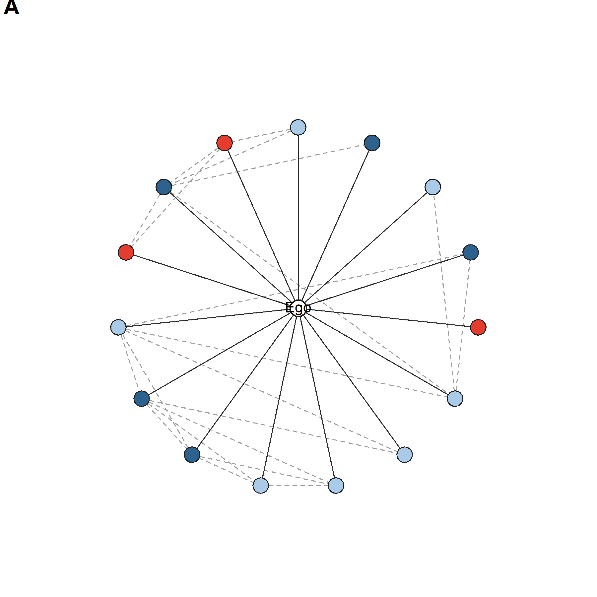
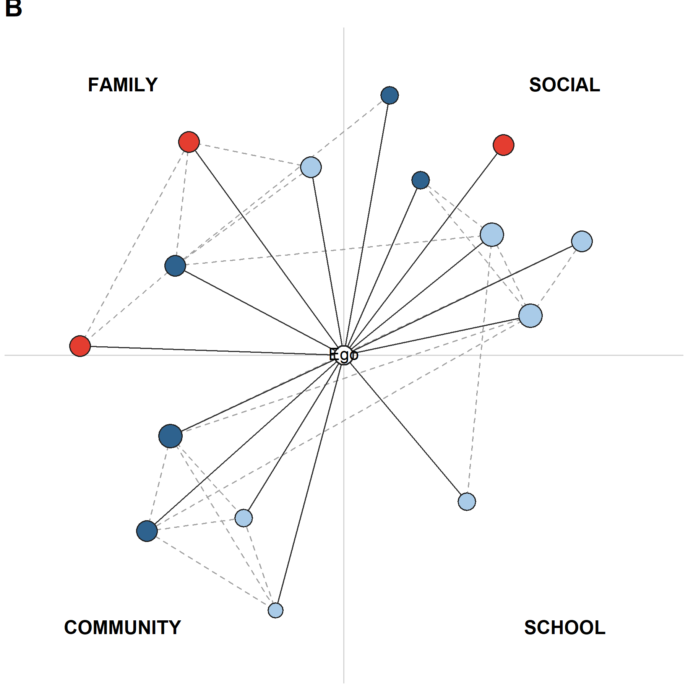

# Overview

This tutorial visualizes the same deidentified Mandarin–English network used in the manuscript's preprocessing walkthrough. It reproduces manuscript Figure 8 as two complementary views of `jefwan37`: a neutral circular layout (A) and a context-organized layout (B).

Both panels contain the same 15 alters, the same ego–alter ties, and the same 21 alter–alter ties. Changing the layout does not change the network.

## Visual encodings

| Visual feature | Meaning |
|---|---|
| Node color | Reported ego–alter interaction language: Mandarin, English, or Mandarin–English |
| Node size in A | Constant; emphasizes composition and topology |
| Node size in B | Emotional closeness |
| Solid line | Ego–alter tie |
| Dashed gray line | Alter–alter tie |
| Position in A | Circular layout without context grouping |
| Position in B | Interaction context: family, social, community, or school |

# 1. Load the included data

The visualization loads the two node- and edge-level CSV files written by the preprocessing tutorial: `jefwan37_tidy_alter.csv` and `jefwan37_alter_edges.csv`. It does not load `jefwan37_ego_compositional_wide.csv`, which contains one row of ego-level summary measures and therefore cannot supply the nodes and ties required for a network plot.

```r
preprocessing_data_dir <- file.path(
  "BiNet_preprocessing_compositional_Measures", "data"
)
figure_dir <- file.path("BiNet_Network_Visualization", "figures")
dir.create(figure_dir, recursive = TRUE, showWarnings = FALSE)

tidy_alter_path <- file.path(
  preprocessing_data_dir, "jefwan37_tidy_alter.csv"
)
alter_edges_path <- file.path(
  preprocessing_data_dir, "jefwan37_alter_edges.csv"
)

alters <- read.csv(
  tidy_alter_path,
  stringsAsFactors = FALSE,
  check.names = FALSE
)
edges <- read.csv(
  alter_edges_path,
  stringsAsFactors = FALSE,
  check.names = FALSE
)

stopifnot(
  nrow(alters) == 15L,
  nrow(edges) == 21L,
  all(c("source", "target") %in% names(edges)),
  all(c(edges$source, edges$target) %in% alters$alter_label)
)
```

The deidentified labels `A01`–`A15` connect the node table and the edge table. They replace names and other direct identifiers.

# 2. Choose stable encodings

Use one color dictionary in every figure so that a language category never changes color between panels.

```r
language_colors <- c(
  "Mandarin" = "#E43D30",
  "English" = "#2E628E",
  "Mandarin-English" = "#A9CBE8"
)
```

In this respondent's reported interaction network, the color counts are:

| Language used | Alters |
|---|---:|
| Mandarin | 3 |
| English | 5 |
| Mandarin–English | 7 |

## Define the shared drawing function

Both panels use the same function to draw alter–alter ties, ego–alter ties, alter nodes, and the central ego. The arguments control whether node size represents emotional closeness and whether context labels are displayed.

```r
draw_panel <- function(alter_data, edge_data, positions,
                       scale_closeness = FALSE, show_contexts = FALSE,
                       panel_label = "A") {
  plot(
    NA, NA,
    xlim = c(-1.25, 1.25), ylim = c(-1.18, 1.18), asp = 1,
    axes = FALSE, xlab = "", ylab = "", bty = "n"
  )

  if (show_contexts) {
    abline(h = 0, v = 0, col = "#D4D4D4", lwd = 1.2)
    text(-0.88, 1.08, "FAMILY", font = 2)
    text(0.88, 1.08, "SOCIAL", font = 2)
    text(-0.88, -1.08, "COMMUNITY", font = 2)
    text(0.88, -1.08, "SCHOOL", font = 2)
  }

  pos <- positions[match(alter_data$alter_label, positions$alter_label), ]
  rownames(pos) <- alter_data$alter_label

  for (i in seq_len(nrow(edge_data))) {
    from <- pos[edge_data$source[i], ]
    to <- pos[edge_data$target[i], ]
    segments(from$x, from$y, to$x, to$y,
             col = "#A0A0A0", lwd = 1.2, lty = 2)
  }

  segments(0, 0, pos$x, pos$y, col = "#303030", lwd = 1.1)
  node_cex <- if (scale_closeness) {
    1.15 + 0.32 * alter_data$emotional_closeness
  } else {
    rep(2.15, nrow(alter_data))
  }
  points(
    pos$x, pos$y, pch = 21, cex = node_cex,
    bg = unname(language_colors[alter_data$languageUsedCategory]),
    col = "#202020", lwd = 1.1
  )
  points(0, 0, pch = 21, cex = 2.25,
         bg = "white", col = "#202020", lwd = 1.4)
  text(0, 0, "Ego", cex = 0.9)
  mtext(panel_label, side = 3, adj = 0,
        line = 0.3, font = 2, cex = 1.35)
}
```

# 3. Panel A: circular layout

The circular view gives every alter the same visual status. It is useful for inspecting overall language composition and alter–alter connectivity without assigning spatial meaning to context.

```r
circle_positions <- function(labels, radius = 0.83) {
  angles <- pi / 2 + 2 * pi * (seq_along(labels) - 1) / length(labels)
  data.frame(
    alter_label = labels,
    x = radius * cos(angles),
    y = radius * sin(angles)
  )
}
```

All alter nodes are drawn at a constant size in Panel A. Solid ego–alter ties radiate from the center; dashed alter–alter ties come directly from `jefwan37_alter_edges.csv`.

Create the circular positions, open a PNG device, call `draw_panel()`, and close the device. This writes Panel A as its own reproducible figure.

```r
panel_a_positions <- circle_positions(alters$alter_label)
panel_a_path <- file.path(
  figure_dir, "fig08A_circular_network_jefwan37.png"
)

png(panel_a_path, width = 1800, height = 1800, res = 300, bg = "white")
par(mar = c(0.2, 0.2, 1.2, 0.2))
draw_panel(
  alters, edges, panel_a_positions,
  scale_closeness = FALSE,
  show_contexts = FALSE,
  panel_label = "A"
)
dev.off()
```



# 4. Panel B: interaction-context layout

The contextualized view moves alters into quadrants based on `interaction_context`. This respondent has no work alters, so no work quadrant is displayed. Node size represents emotional closeness, allowing context, language use, and tie strength to be inspected together.

```r
context_positions <- function(alter_data) {
  ranges <- list(
    family = c(100, 178), social = c(12, 80),
    community = c(205, 255), school = c(285, 335)
  )
  placed <- lapply(names(ranges), function(context) {
    labels <- alter_data$alter_label[
      alter_data$interaction_context == context
    ]
    if (!length(labels)) return(NULL)
    limits <- ranges[[context]]
    degrees <- if (length(labels) == 1L) mean(limits) else
      seq(limits[1], limits[2], length.out = length(labels))
    radius <- rep(c(0.76, 1.05), length.out = length(labels))
    angles <- degrees * pi / 180
    data.frame(
      alter_label = labels,
      x = radius * cos(angles),
      y = radius * sin(angles)
    )
  })
  do.call(rbind, placed)
}
```

The alternating radii reduce overlap in dense contexts. They are a display choice and do not represent an additional network variable.

Use the context positions in the same drawing function. Here `scale_closeness = TRUE` changes node size, and `show_contexts = TRUE` adds the quadrant guides and labels.

```r
panel_b_positions <- context_positions(alters)
panel_b_path <- file.path(
  figure_dir, "fig08B_context_network_jefwan37.png"
)

png(panel_b_path, width = 1800, height = 1800, res = 300, bg = "white")
par(mar = c(0.2, 0.2, 1.2, 0.2))
draw_panel(
  alters, edges, panel_b_positions,
  scale_closeness = TRUE,
  show_contexts = TRUE,
  panel_label = "B"
)
dev.off()
```



# 5. Combine Panels A and B as Figure 8

The final manuscript figure draws both panels on one device and reserves the bottom row for shared legends.

```r
combined_path <- file.path(
  figure_dir, "fig08_network_views_jefwan37.png"
)

png(combined_path, width = 3480, height = 2040, res = 300, bg = "white")
layout(matrix(c(1, 2, 3, 3), nrow = 2, byrow = TRUE),
       heights = c(5.1, 0.9))
par(mar = c(0.2, 0.2, 1.2, 0.2))

draw_panel(
  alters, edges, panel_a_positions,
  scale_closeness = FALSE, panel_label = "A"
)
draw_panel(
  alters, edges, panel_b_positions,
  scale_closeness = TRUE, show_contexts = TRUE, panel_label = "B"
)

par(mar = rep(0, 4))
plot.new()
plot.window(xlim = c(0, 1), ylim = c(0, 1))
legend(
  x = 0.05, y = 0.88,
  legend = c("Ego", names(language_colors)),
  pt.bg = c("white", unname(language_colors)),
  pch = 21, pt.cex = 1.5, col = "#202020",
  horiz = TRUE, bty = "n", xpd = NA, x.intersp = 0.8
)
legend(
  x = 0.08, y = 0.38,
  legend = c("Ego-alter tie", "Alter-alter tie"),
  col = c("#303030", "#A0A0A0"),
  lty = c(1, 2), lwd = 1.2,
  horiz = TRUE, bty = "n", xpd = NA, seg.len = 2.2
)
text(0.78, 0.64, "Panel B emotional closeness", cex = 0.9)
closeness_values <- c(1, 3, 5)
closeness_x <- c(0.70, 0.80, 0.90)
points(
  closeness_x, rep(0.28, 3), pch = 21,
  cex = 1.15 + 0.32 * closeness_values,
  bg = "#D9D9D9", col = "#202020"
)
text(closeness_x + 0.035, rep(0.28, 3),
     labels = closeness_values, adj = 0)
dev.off()
```

## One-command reproduction

Run from the repository root:

```bash
Rscript BiNet_Network_Visualization/code/generate_jefwan37_network.R
```

The script runs all steps above, validates the node and edge counts, and writes the separate Panel A and Panel B images plus the combined `figures/fig08_network_views_jefwan37.png`. It uses base R, so no additional package installation is required.


# 6. Adapt the code to another participant

To reuse the script, provide one tidy alter file and one edge file with the same minimum fields:

- alter table: `alter_label`, `languageUsedCategory`, `interaction_context`, and `emotional_closeness` (filter to one `ego_id` first if the table contains multiple egos);
- edge table: `source` and `target`, using the alter labels from the node table.

Before plotting, verify that every edge endpoint occurs in the alter table, every alter has exactly one analysis context, and each language category has a defined color. Context placement and node-size scaling can then be adjusted without changing the underlying measures.
