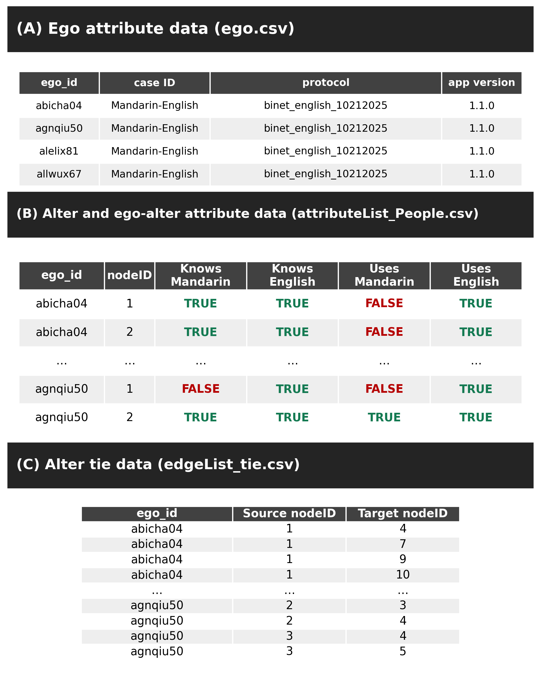
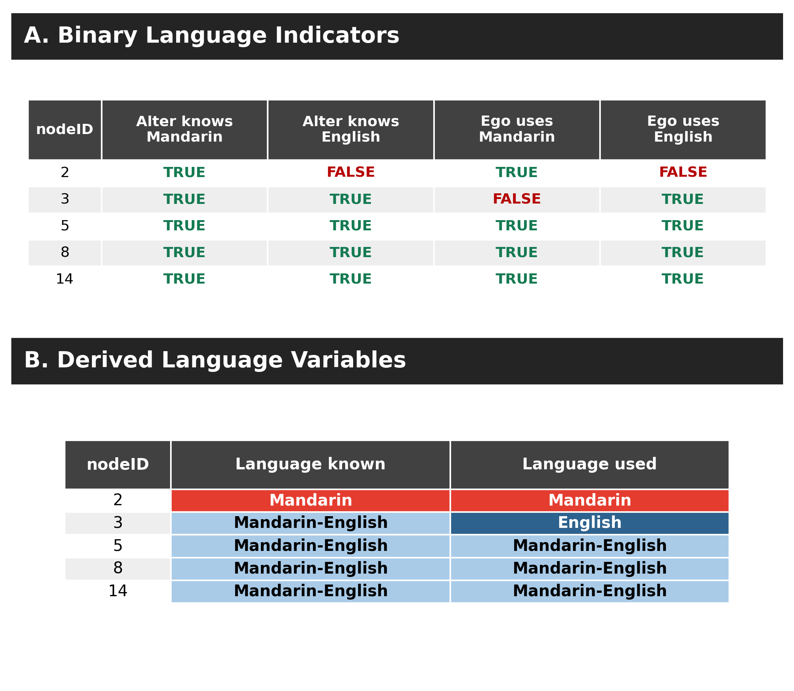
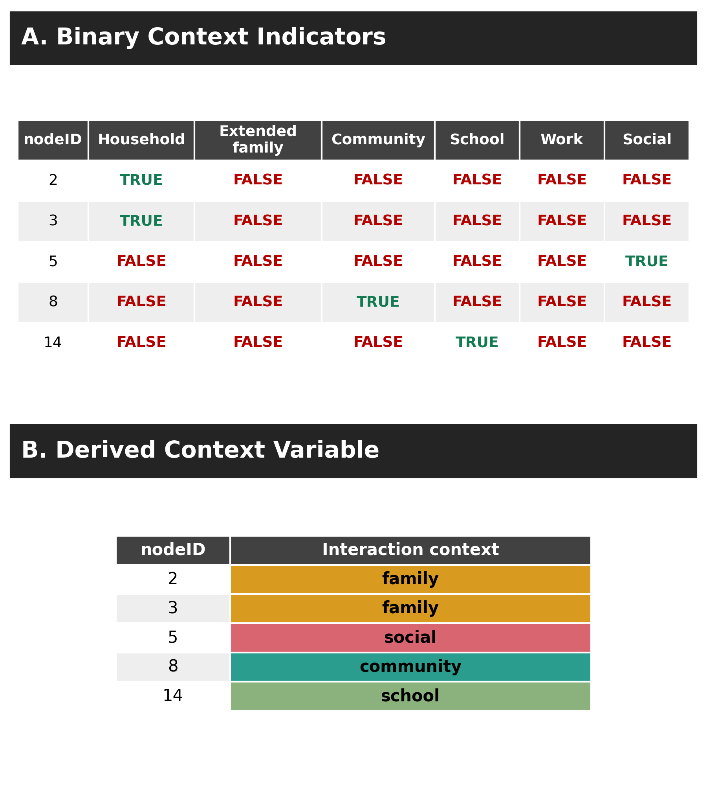
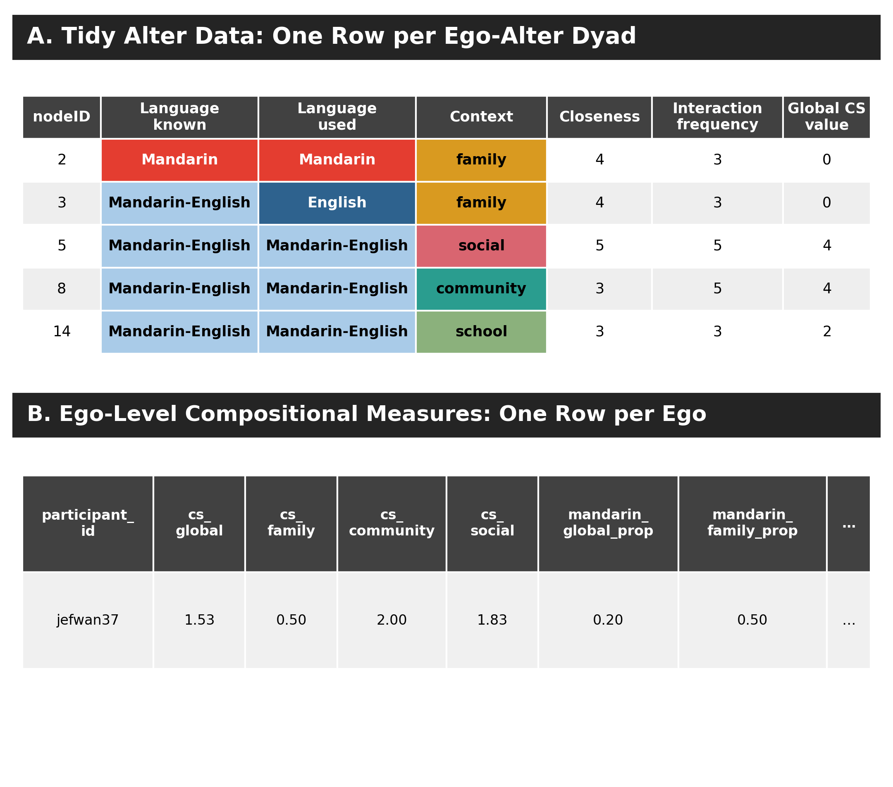

# Overview

This tutorial reproduces the Mandarin–English real-data walkthrough used in the BiNet manuscript. One deidentified respondent, `jefwan37`, is followed from binary Network Canvas indicators to tidy ego–alter data and ego-level compositional measures. The same records are used in every table, code block, and figure.

The respondent nominated 15 alters and 21 alter–alter ties. In reported interaction, 3 dyads were Mandarin-only, 5 were English-only, and 7 were Mandarin–English. Mandarin is the respondent's L1 and English is the respondent's L2.

## Files

- `data/jefwan37_raw_flags.csv`: deidentified binary indicators and dyad ratings.
- `data/jefwan37_tidy_alter.csv`: one row per ego–alter dyad after recoding.
- `data/jefwan37_alter_edges.csv`: deidentified alter–alter ties.
- `data/jefwan37_ego_compositional_wide.csv`: one-row ego-level output.
- `code/reproduce_jefwan37_measures.R`: standalone reproduction and validation script.
- `excel/BiNet_jefwan37_real_data_walkthrough.xlsx`: inspectable workbook with source, tidy, output, and quality-check sheets.

Run the complete analysis from the repository root:

```bash
Rscript BiNet_preprocessing_compositional_Measures/code/reproduce_jefwan37_measures.R
```

# 1. Load and audit the dyad data

```{r}
library(dplyr)
library(readr)

alter <- read_csv("data/jefwan37_tidy_alter.csv", show_col_types = FALSE)
edges <- read_csv("data/jefwan37_alter_edges.csv", show_col_types = FALSE)

stopifnot(
  nrow(alter) == 15,
  nrow(edges) == 21,
  all(alter$participant_id == "jefwan37")
)
```

The checks establish the denominator before aggregation. This matters because proportions and means are interpretable only when the eligible rows are known.



# 2. Recode binary language indicators

Network Canvas exports one Boolean column for each language. Two paired indicators become one categorical variable:

| Mandarin | English | Derived category |
|---:|---:|---|
| `TRUE` | `FALSE` | `Mandarin` |
| `FALSE` | `TRUE` | `English` |
| `TRUE` | `TRUE` | `Mandarin-English` |
| `FALSE` | `FALSE` | `Other` or missing, depending on the protocol |

```{r}
alter <- alter |>
  mutate(
    languageKnownCategory = case_when(
      alter_knows_Mandarin & alter_knows_English ~ "Mandarin-English",
      alter_knows_Mandarin ~ "Mandarin",
      alter_knows_English ~ "English",
      TRUE ~ "Other"
    ),
    languageUsedCategory = case_when(
      ego_uses_Mandarin & ego_uses_English ~ "Mandarin-English",
      ego_uses_Mandarin ~ "Mandarin",
      ego_uses_English ~ "English",
      TRUE ~ "Other"
    )
  )
```

`languageKnownCategory` describes the alter's repertoire. `languageUsedCategory` describes the language(s) the ego reports using with that alter. They answer different questions and should not be substituted for one another.



# 3. Recode interaction context

The protocol stores contexts in separate indicator columns. Household and extended family are combined into `family`; the other occupied contexts remain `community`, `school`, `work`, and `social`.

```{r}
raw <- read_csv("data/jefwan37_raw_flags.csv", show_col_types = FALSE)

raw <- raw |>
  mutate(
    interaction_context = case_when(
      household | extended_family ~ "family",
      community ~ "community",
      school ~ "school",
      work ~ "work",
      social ~ "social",
      TRUE ~ NA_character_
    )
  )

context_flags <- c("household", "extended_family", "community", "school", "work", "social")
stopifnot(all(rowSums(as.data.frame(raw[context_flags])) == 1))
```

The mutually exclusive check prevents one dyad from silently entering more than one context summary. In this network, family has 4 alters, community 4, social 6, school 1, and work 0.



# 4. Construct the tidy alter table

The analysis table keeps one row per ego–alter dyad. It contains stable identifiers, the two derived language variables, one context variable, continuous dyad ratings, and the language flags needed for L1/L2 homophily.

```{r}
tidy_alter <- alter |>
  select(
    participant_id, alter_label, nodeID,
    languageKnownCategory, languageUsedCategory, interaction_context,
    emotional_closeness, interaction_frequency, codeswitching_frequency,
    alter_knows_Mandarin, alter_knows_English,
    ego_uses_Mandarin, ego_uses_English
  )
```

# 5. Construct ego-level compositional measures

## 5.1 Code-switching means

The questionnaire asks for code-switching frequency only when more than one interaction language is selected. For the manuscript analysis, a Mandarin-only or English-only dyad contributes a genuine `0`; a Mandarin–English dyad retains its reported 1–4 rating. This rule keeps all 15 nominated alters in the network-wide denominator.

```{r}
alter <- alter |>
  mutate(
    cs_zero_coded = case_when(
      languageUsedCategory %in% c("Mandarin", "English") ~ 0,
      languageUsedCategory == "Mandarin-English" ~ codeswitching_frequency,
      TRUE ~ NA_real_
    )
  )
```

Do not use `mean(codeswitching_frequency, na.rm = TRUE)` for this analysis: that would average only the 7 bilingual dyads and would answer a different question.

```{r}
mean_or_na <- function(x) {
  observed <- x[!is.na(x)]
  if (length(observed) == 0L) NA_real_ else mean(observed)
}

context_mean <- function(values, contexts, target) {
  mean_or_na(values[contexts == target])
}

cs_measures <- alter |>
  group_by(participant_id) |>
  summarise(
    cs_global = mean_or_na(cs_zero_coded),
    cs_family = context_mean(cs_zero_coded, interaction_context, "family"),
    cs_community = context_mean(cs_zero_coded, interaction_context, "community"),
    cs_social = context_mean(cs_zero_coded, interaction_context, "social"),
    cs_school = context_mean(cs_zero_coded, interaction_context, "school"),
    .groups = "drop"
  )
```

For `jefwan37`, `cs_global = 1.53`. Context means are 0.50 for family, 2.00 for community, 1.83 for social, and 2.00 for school. A context with no alters has no denominator and is `NA`, not zero.

## 5.2 Mandarin-only interaction proportions

Count-based composition measures are named as proportions. Here an alter contributes 1 only when the dyad's reported interaction is Mandarin-only; Mandarin–English dyads are not counted as Mandarin-only.

```{r}
context_prop <- function(flags, contexts, target) {
  mean_or_na(flags[contexts == target])
}

mandarin_measures <- alter |>
  group_by(participant_id) |>
  summarise(
    mandarin_global_prop = mean_or_na(languageUsedCategory == "Mandarin"),
    mandarin_family_prop = context_prop(languageUsedCategory == "Mandarin", interaction_context, "family"),
    mandarin_community_prop = context_prop(languageUsedCategory == "Mandarin", interaction_context, "community"),
    mandarin_social_prop = context_prop(languageUsedCategory == "Mandarin", interaction_context, "social"),
    .groups = "drop"
  )
```

If a respondent has alters in a context but none meet the criterion, the proportion is `0`. Only a context with no alters is `NA`.

## 5.3 Ego-specific L1/L2 homophily

Language homophily must be mapped to each ego's language profile rather than tied permanently to Mandarin or English. For this respondent, L1 is Mandarin and L2 is English. A bilingual dyad contributes to both L1 and L2 homophily.

```{r}
ego_profile <- tibble(
  participant_id = "jefwan37",
  ego_l1 = "Mandarin",
  ego_l2 = "English"
)

alter_profiled <- alter |>
  left_join(ego_profile, by = "participant_id") |>
  mutate(
    l1_match = case_when(
      ego_l1 == "Mandarin" ~ ego_uses_Mandarin,
      ego_l1 == "English" ~ ego_uses_English,
      TRUE ~ NA
    ),
    l2_match = case_when(
      ego_l2 == "Mandarin" ~ ego_uses_Mandarin,
      ego_l2 == "English" ~ ego_uses_English,
      TRUE ~ NA
    )
  )

homophily <- alter_profiled |>
  group_by(participant_id, ego_l1, ego_l2) |>
  summarise(
    prop_l1_homophily = mean_or_na(l1_match),
    prop_l2_homophily = mean_or_na(l2_match),
    .groups = "drop"
  )
```

Ten of 15 alters are used with Mandarin, so `prop_l1_homophily = 0.67`. Twelve of 15 are used with English, so `prop_l2_homophily = 0.80`.

## 5.4 Wide ego-level output

```{r}
ego_compositional <- cs_measures |>
  left_join(mandarin_measures, by = "participant_id") |>
  left_join(homophily, by = "participant_id")

write_csv(ego_compositional, "data/jefwan37_ego_compositional_wide.csv")
ego_compositional
```



# 6. Expected results and validation

| Measure | Expected value |
|---|---:|
| `cs_global` | 1.53 |
| `cs_family` | 0.50 |
| `cs_community` | 2.00 |
| `cs_social` | 1.83 |
| `cs_school` | 2.00 |
| `mandarin_global_prop` | 0.20 |
| `mandarin_family_prop` | 0.50 |
| `mandarin_community_prop` | 0.00 |
| `mandarin_social_prop` | 0.17 |
| `prop_l1_homophily` | 0.67 |
| `prop_l2_homophily` | 0.80 |

The standalone script includes assertions for the network size, language composition, global CS mean, and both homophily values. The workbook provides the same source-to-output trail for readers who prefer to inspect the calculations without running R.

# 7. Next step

Continue with the [network visualization tutorial](../BiNet_Network_Visualization/BiNet_network_visualization.md), which uses these same 15 alters and 21 alter–alter ties to reproduce manuscript Figure 8A/B.
